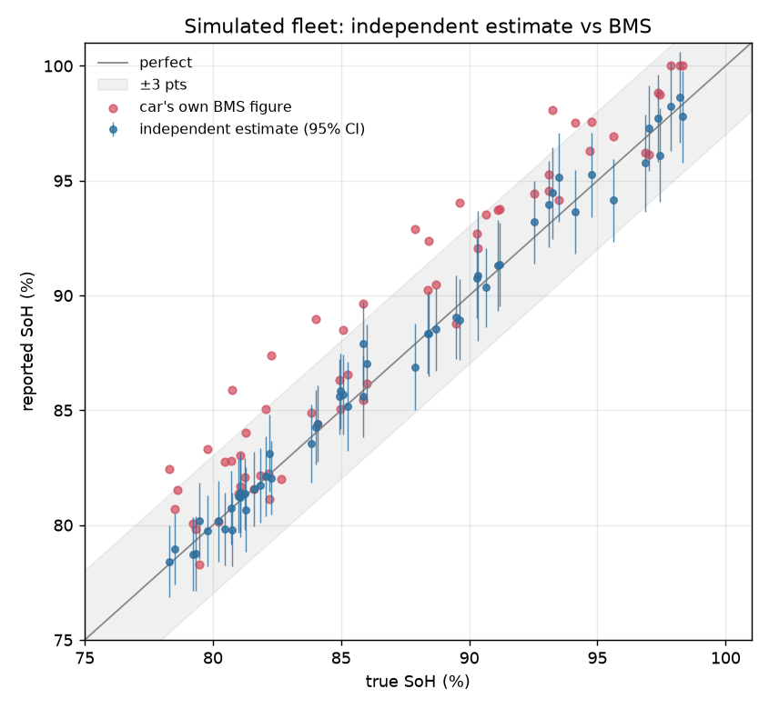

# soh-proto: independent EV battery health from charging logs

Prototype for measuring an EV battery's state of health (SoH) **without
trusting the car's own BMS figure**.

## Method

For each logged charging session:

```
capacity [Ah] = charge put in [Ah] / (SoC after − SoC before)
```

Both SoC values come from the **rested pack voltage** through the cell's OCV
curve, so they don't depend on the BMS. Using the BMS's displayed SoC instead
would be circular: the BMS counts current against its own capacity figure, so
you only get the BMS's number back, bias included. The validation shows this.

A session is used only if the charge covers ≥30% SoC and the logger kept
recording ≥30 min after charging stopped, so the voltage can relax. Sessions
are combined by inverse-variance weighting. A systematic floor (current-sensor
gain, OCV-curve mismatch) is added to the 95% interval.

## Run

```bash
pip install -r requirements.txt
python -m soh_proto validate --out results          # accuracy on a simulated fleet
python -m soh_proto simulate --out data --cars 2    # write example logs
python -m soh_proto estimate data/car_000 --bms-soh 0.924
python -m pytest -q
```

Log format (one CSV per session, recorded from plug-in until ≥30 min after
charging ends): `time_s, current_a, pack_voltage_v, soc_bms_pct, temp_c`,
with current positive while charging.

## Simulated fleet result (60 cars, seed 7)

| | mean bias | mean abs error | 95th pct error | within ±3 pts |
|---|---|---|---|---|
| Independent estimate | +0.1 pts | 0.5 pts | 1.4 pts | 100% |
| Car's own BMS figure | +1.8 pts | 2.0 pts | 4.9 pts | 78% |
| Ah ÷ BMS SoC (naive) | +2.0 pts | 2.2 pts | 5.1 pts | 76% |

The 95% interval contains the true value for 98% of cars. 5 of 60 cars had no
usable session (only short top-ups or unplugged too soon).



## Limits

- **This is simulated data.** The simulator includes sensor gain and offset
  errors, noise, hysteresis, incomplete relaxation, OCV-curve mismatch and a
  biased BMS, but it is still a model. Real accuracy has to be shown against a
  reference full-discharge test on real cars.
- `ocv.py` uses a generic NMC curve. Each platform needs its own curve.
- LFP cells have a very flat OCV curve, so this method is weak for them.
- Assumes a 96s pack with 180 Ah nominal capacity; pass `--n-series` and
  `--nominal-ah` for other packs.

## Next step with a real car

Log 5–10 home charging sessions with an OBD dongle (e.g. OBDLink MX+ on a
Hyundai/Kia E-GMP, or Tesla telemetry). Start with a low battery, charge to
80–100%, and leave the logger running 30+ minutes after charging stops.
Then compare the result with a full drive-down capacity test.
